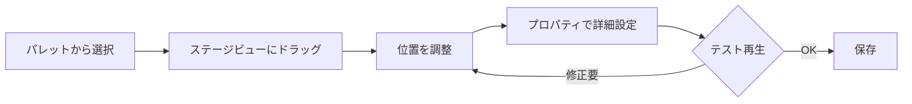

# 横スクロールシューティング ステージエディタ設計書

## 概要

本ドキュメントは、横スクロールシューティングゲーム「Scrollshooting」のステージエディタの設計をまとめたものです。企画書のアイデア5選を基に、具体的な実装方針を示します。

---

## 1. 過去の事例から学ぶ設計指針

### 1.1 参考となるツール・ゲーム

| ツール名 | 特徴 | 学べるポイント |
|---------|------|---------------|
| デザエモン (SFC) | グラフィック・ステージ・音楽エディタ統合 | ワンストップで完結する統合環境 |
| SEUCK (C64) | プログラミング不要のSTG制作 | ノーコードの重要性 |
| シューティングゲームビルダー | PC向け現代ツール | グラフィカルUI |
| Stage U (スマホ) | ドラッグ&ドロップ配置、即時テスト | モバイル向けUI設計 |
| マリオメーカー | タッチペン操作、パレット切替 | 直感的操作とプリセット |

### 1.2 採用する設計原則

1. **ノーコード操作**: プログラミング知識なしでステージ構築可能
2. **即時プレビュー**: 編集→テストのサイクルを最短に
3. **プリセット活用**: 頻出パターンをテンプレート化
4. **シンプルなワークフロー**: 「選ぶ→置く→調整」の3ステップ

---

## 2. エディタUI設計

### 2.1 画面レイアウト

```
┌─────────────────────────────────────────────────────────┐
│ ツールバー: [保存] [読込] [テスト再生] [設定]           │
├──────────────────────────────────┬──────────────────────┤
│                                  │                      │
│                                  │   パレット           │
│                                  │   ┌────────────┐     │
│     ステージビューア             │   │ 敵機       │     │
│     (グリッド表示)               │   │ 障害物     │     │
│                                  │   │ アイテム   │     │
│     ←──────スクロール──────→    │   │ ボス       │     │
│                                  │   │ 背景       │     │
│                                  │   │ イベント   │     │
│                                  │   └────────────┘     │
├──────────────────────────────────┴──────────────────────┤
│ タイムライン                                            │
│ 0s────5s────10s────15s────20s────25s────30s────...       │
│ ├─Wave1─┤├──Wave2──┤├─Boss─┤                            │
├─────────────────────────────────────────────────────────┤
│ プロパティパネル (選択オブジェクトの設定)               │
│ [出現時間] [移動パターン] [弾幕設定] [HP]               │
└─────────────────────────────────────────────────────────┘
```

### 2.2 主要UI要素

#### パレットパネル
- **敵機**: ザコ、中型、大型、ボスのカテゴリ分け
- **障害物**: 地形ブロック、破壊可能オブジェクト
- **アイテム**: パワーアップ、スコア、1UP
- **イベント**: ボス戦開始、背景変化、BGM切替

#### タイムラインパネル
- 横軸: 経過時間（秒）
- 縦軸: Wave/レーン（複数の敵グループを並列表示）
- ドラッグで出現タイミング調整
- Waveのグループ化・複製機能

#### プロパティパネル
- 選択オブジェクト固有の設定
- スライダー/ドロップダウンによる直感的調整
- プリセット選択ボタン

### 2.3 操作フロー



### 2.4 モバイル対応 (iPad)

- 大きめのタップターゲット (最小44x44pt)
- ピンチでズーム、2本指スワイプでスクロール
- 長押しでコンテキストメニュー
- 画面回転対応（横向き固定推奨）

---

## 3. ランダム要素と固定パターンの設計

### 3.1 ハイブリッド構成

```
ステージ構成
├── 導入部 (固定) - プレイヤーが操作に慣れる
├── 前半 (ランダムプール) - 毎回異なる展開
│   └── Wave A/B/C からランダム選択
├── 中盤 (セミランダム) - パターンは固定、出現位置にゆらぎ
├── 中ボス (固定) - パターン攻略の楽しさ
├── 後半 (固定) - 難易度調整された構成
└── ボス戦 (固定) - 覚えゲー要素
```

### 3.2 エディタでの設定方法

#### WaveType列挙型
```csharp
public enum WaveType
{
    Fixed,          // 完全固定
    RandomPool,     // プールからランダム選択
    RandomPosition, // 位置のみランダム
    RandomTiming,   // タイミングのみランダム
    Dynamic         // プレイヤー状況で変化
}
```

#### ランダムプール設定UI
- Wave を「ランダムグループ」に指定
- グループ内に複数のパターン候補を登録
- 出現確率の重み付け設定

### 3.3 動的難易度調整 (オプション)

| パラメータ | 影響 |
|-----------|------|
| プレイヤー残機 | 少ないほど敵弾量減少 |
| 連続被弾 | 一時的に敵攻撃頻度低下 |
| ノーミスクリア | 隠し敵出現、スコアボーナス |

---

## 4. アセット方針 (2D vs 3D)

### 4.1 推奨: 2.5Dアプローチ

| 要素 | 採用技術 | 理由 |
|------|---------|------|
| ゲームプレイ | 2D (XY平面) | シンプルな当たり判定、古典的STG体験 |
| 背景 | 3D (ローポリ) | 奥行き感、ダイナミックな演出 |
| 敵機/自機 | 3D (ローポリ) or 2Dスプライト | ProBuilderで手軽に作成可能 |
| エフェクト | パーティクル | Unityの得意分野 |

### 4.2 ProBuilder活用

```
地形作成フロー:
1. ProBuilderで基本形状作成 (Cube, Cylinder等)
2. 頂点編集で洞窟/基地形状に加工
3. 単色マテリアル適用 (レトロ風)
4. Prefab化してエディタパレットに登録
```

### 4.3 パフォーマンス考慮

- **ターゲット**: iPad Air以上で60fps
- **ポリゴン数目安**: 画面内合計10,000ポリ以下
- **軽量化オプション**:
  - シンプル描画モード（パーティクル削減）
  - 影描画OFF
  - 背景LOD切替

### 4.4 アセット調達戦略

1. **ProBuilder**: 地形、シンプルな機体
2. **Asset Store**: 背景素材、エフェクト
3. **無料素材サイト**: 効果音、BGM
4. **自作**: ゲーム固有のキャラクター

---

## 5. データ形式と保存システム

### 5.1 採用形式: JSON

**理由**:
- 人間が読める（デバッグしやすい）
- Unityで標準サポート (JsonUtility)
- サーバー連携が容易
- バージョン管理しやすい（テキスト差分）

### 5.2 ステージデータ構造

```json
{
  "stageId": "stage_01",
  "meta": {
    "name": "宇宙港脱出",
    "author": "developer",
    "difficulty": 2,
    "duration": 180,
    "version": "1.0.0"
  },
  "settings": {
    "scrollSpeed": 2.5,
    "backgroundColor": "#0a0a2e",
    "bgm": "bgm_stage01"
  },
  "waves": [
    {
      "id": "wave_01",
      "type": "Fixed",
      "startTime": 5.0,
      "enemies": [
        {
          "type": "SmallFighter",
          "position": {"x": 10, "y": 3},
          "movePattern": "StraightLeft",
          "bulletPattern": "SingleShot",
          "hp": 1
        }
      ]
    },
    {
      "id": "wave_02",
      "type": "RandomPool",
      "startTime": 15.0,
      "patternPool": ["pattern_A", "pattern_B", "pattern_C"],
      "weights": [0.4, 0.4, 0.2]
    }
  ],
  "boss": {
    "type": "SpaceCruiser",
    "appearTime": 150.0,
    "phases": [
      {"hp": 100, "pattern": "Phase1Attack"},
      {"hp": 50, "pattern": "Phase2Attack"}
    ]
  },
  "terrain": [
    {
      "prefab": "WallBlock",
      "position": {"x": 50, "y": -2},
      "scale": {"x": 10, "y": 1, "z": 1}
    }
  ]
}
```

### 5.3 C# クラス設計（実装済み）

```csharp
// ステージ全体
[Serializable]
public class Stage
{
    public string StageId;
    public string StageName;
    public StageMeta Meta;
    public SerializableDictionary<string, StageTimeline> Timelines;
    public SerializableDictionary<string, Event> Events;
}

// タイムライン（開幕〜中ボス、中ボス撃破〜ボスなど分割可能）
[Serializable]
public class StageTimeline
{
    public string TimelineId;
    public string TimelineName;
    public float ScrollSpeed;
    public List<TimelineEvent> Events;  // 時間でソートされる
}

// 時間に紐づくイベント参照
[Serializable]
public class TimelineEvent
{
    public float Time;       // 実行時間（秒）
    public string EventId;   // 実行するイベントのID
}

// イベント定義
[Serializable]
public class Event
{
    public string EventId;
    public EventType EventType;  // SpawnSingleEnemy, SpawnFormation, SpawnBoss, etc.
    public string TargetId;      // 敵/編隊/タイムラインID
    public Vector2 SpawnPosition;
    public bool HasOnDestroyEvent;
    public EventType OnDestroyEventType;
    public string OnDestroyEventId;
}

// 敵定義（別DBで管理）
[Serializable]
public class Enemy
{
    public string EnemyId;
    public string EnemyName;
    public int Hp;
    public int Score;
    public string MovePatternId;
    public string BulletPatternId;
}
```

### 5.4 保存/読込フロー

```
[保存]
StageData → JsonUtility.ToJson() → File.WriteAllText()
                                  ↓
                         {stageId}.stage.json

[読込]
File.ReadAllText() → JsonUtility.FromJson<StageData>() → ステージ生成
```

### 5.5 将来の拡張: オンライン共有

```
┌─────────────┐     ┌─────────────┐     ┌─────────────┐
│ エディタ    │ ──→ │ サーバー    │ ←── │ 他ユーザー  │
│ (作成/保存) │     │ (JSON保管)  │     │ (ダウンロード)|
└─────────────┘     └─────────────┘     └─────────────┘
                          ↓
                    ランキング/評価
```

---

## 6. 実装フェーズ

### Phase 1: 基盤構築 [完了]
- [x] StageData クラス定義
- [x] JSON 読込/保存機能
- [x] 基本的なステージ再生システム

### Phase 2: エディタUI [完了]
- [x] タイムラインベースのステージビューア
- [x] イベント/敵/パターン タブ構成
- [x] ドラッグ&ドロップ配置

### Phase 3: 詳細編集 [完了]
- [x] タイムラインUI
- [x] プロパティパネル
- [x] 移動パターン/弾幕エディタ
- [x] 敵エディタ
- [x] 編隊エディタ（プリセット付き）

### Phase 4: テスト機能 [進行中]
- [x] 即時プレビュー再生（Test Playボタン）
- [ ] 任意時点からの再生
- [ ] デバッグ表示（当たり判定可視化）

### Phase 5: 拡張機能 [未着手]
- [ ] ランダムWave設定
- [ ] ボスエディタ
- [ ] ユーザー共有機能（将来）

---

## 7. ファイル構成（実装済み）

```
Assets/
├── Scripts/
│   └── StageEditor/
│       ├── Data/                        # データ定義
│       │   ├── StageData.cs             # ステージ・イベント・敵・パターン等の全データ構造
│       │   └── StageSerializer.cs       # JSON保存/読込
│       ├── Editor/                      # Unityエディタ拡張
│       │   ├── StageEditorWindow.cs     # メインエディタウィンドウ
│       │   ├── EnemyEditorWindow.cs     # 敵エディタ
│       │   ├── FormationEditorWindow.cs # 編隊エディタ（プレビュー付き）
│       │   └── PatternEditorWindow.cs   # 移動/弾幕パターンエディタ
│       └── Runtime/                     # ランタイム実行
│           ├── StageManager.cs          # ステージ実行マネージャー
│           └── EnemyController.cs       # 敵制御・弾生成
├── StageData/                           # 保存されたJSONファイル
│   ├── *.stage.json                     # ステージデータ
│   ├── enemies.enemies.json             # 敵データベース
│   └── patterns.patterns.json           # パターンデータベース
└── Scenes/
    └── SampleScene.unity                # メインシーン
```

---

## 8. エディタの使い方

### 8.1 起動方法

Unityメニューから **Tools > Stage Editor** (ショートカット: Cmd+Shift+E) を選択

### 8.2 基本操作

#### タブ構成
| タブ | 説明 |
|-----|------|
| Timeline | タイムラインでイベント配置・時間調整 |
| Events | イベント一覧の管理 |
| Enemies | 敵・編隊データベースの編集 |
| Patterns | 移動・弾幕パターンの編集 |
| Settings | ステージメタ情報の設定 |

#### Timeline タブ操作
1. タイムライン選択ドロップダウンでタイムラインを切り替え
2. 「Add Event at Time...」でイベントを追加
3. イベントをドラッグして時間を調整
4. ズームスライダーで表示倍率を変更
5. マウスホイールで左右スクロール

#### プロパティパネル
- イベントを選択すると右側にプロパティが表示
- イベントタイプに応じた設定項目が表示される

### 8.3 ワークフロー例

```
1. [Enemies タブ] 敵を定義
   ↓
2. [Patterns タブ] 移動・弾幕パターンを定義
   ↓
3. [Events タブ] イベントを作成（敵出現、ボス等）
   ↓
4. [Timeline タブ] イベントを時間軸に配置
   ↓
5. [Test Play] ボタンでテスト再生
   ↓
6. [Save] で保存
```

### 8.4 ファイル保存場所

- ステージデータ: `Assets/StageData/{StageId}.stage.json`
- 敵データベース: `Assets/StageData/enemies.enemies.json`
- パターンデータベース: `Assets/StageData/patterns.patterns.json`

---

## 9. 参考資料

- [デザエモン - ゲームカタログ@Wiki](https://w.atwiki.jp/gcmatome/pages/5847.html)
- [Stage U - もぐらゲームス](https://www.moguragames.com/stage-u-iphone-game/)
- [ゲーム作りラボ - シューティング制作ツール5選](https://game-sakusei.com/game_create_tools/11134.html)
- [ザナック - Wikipedia (ALC システム)](https://ja.wikipedia.org/wiki/%E3%82%B6%E3%83%8A%E3%83%83%E3%82%AF)
